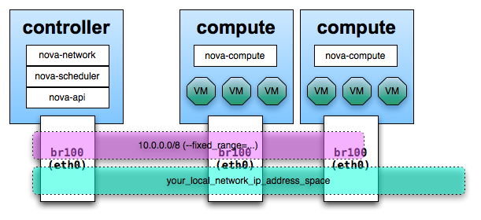
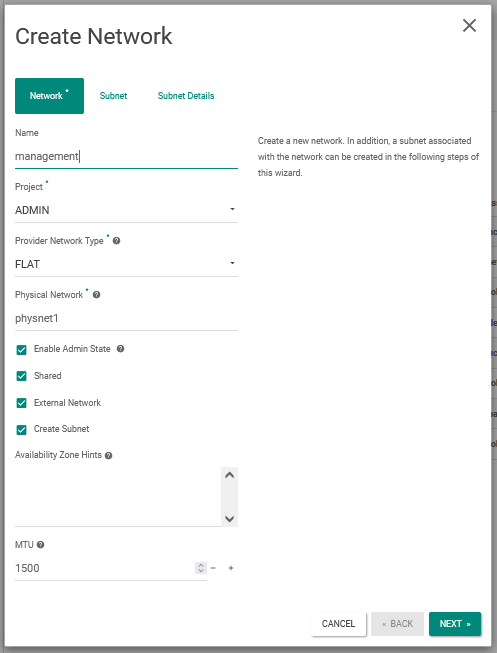
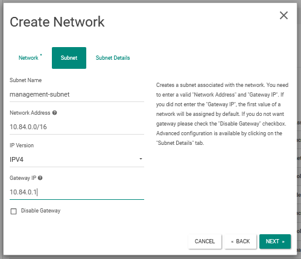
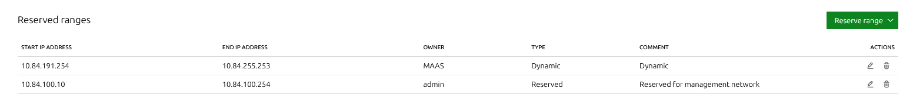
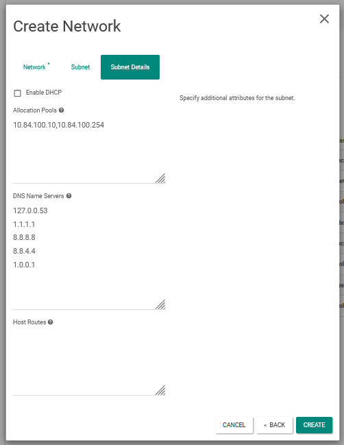

# Como configurar uma rede Flat de Management no OpenStack

"FlatNetworking uses ethernet adapters configured as bridges to allow network traffic to transit between all the various nodes. This setup can be done with a single adapter on the physical host, or multiple. This option _*does not*_ require a switch that does VLAN tagging (VLANNetworking does) - and is a common development installation or proof of concept setup."

- https://wiki.openstack.org/wiki/UnderstandingFlatNetworking
- https://docs.openstack.org/install-guide/launch-instance-networks-provider.html



- Crie como administrador uma rede no OpenStack com seguintes configurações, verificar o arquivo de configuração do `neutron.yaml` para interface física:


## via dashboard



- Crie um subnet no mesmo CIDR do controlador, no nosso caso `10.84.0.0/16` com gateway em `10.84.0.1`



- Crie uma faixa restrita no MAAS do controlador e configure o DHCP externo e após isso está pronto, também desativar dhcp





Já é possível usar a rede para comunicar-se com as instâncias via controller e por meio do servidor vnc

## via cli
```sh
openstack network create \
	--external --share \
	--provider-network-type flat \
	--provider-physical-network physnet1 management-network
```
```sh
openstack subnet create \
	--network management-network \
	--no-dhcp \
	--gateway 10.84.0.1 \
	--subnet-range 10.84.0.0/16 \
	--allocation-pool start=10.84.100.10,end=10.84.100.254 \
	--dns-nameserver 200.18.99.1 \
	--dns-nameserver 1.1.1.1 \
	--dns-nameserver 8.8.8.8 \
	--dns-nameserver 8.8.4.4 \
	--dns-nameserver 1.0.0.1 \
	management-subnet
```
