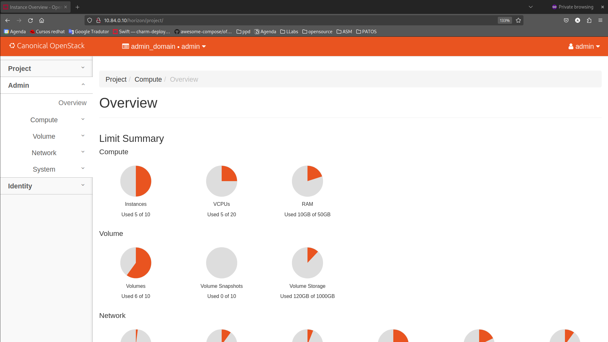

# Criação de Provider Networks no OpenStack
## Um pouco de teoria
Antes de criarmos nossa rede física no OpenStack, é importante que alguns conceitos estejam claros
### O que é uma provider network?
No OpenStack, o conceito de provider network se refere ao mapeamento de redes do ambiente físico do cluster para \
o ambiente virtual, gerenciado pelo Neutron. Isso é usado para que instâncias (VMs dos "clientes") se comuniquem \
como mundo externo, ou seja, tenham acesso e estejam acessíveis para a internet.
### O que é uma flat network?
Flat network neste contexto diz respeito a uma rede física "simples", ou seja, uma rede que não é VLAN tagged e \
que está conectada diretamente no computador a qual o OpenStack está instalado
## Conferindo a configuração
Para cada rede flat que criamos dentro do OpenStack, precisamos de uma rede física mapeada no OVN. Deste modo, é \
importante que todos os passos do [guia de configuração de rede física](https://github.com/Pesquisa-Cloud-UFSCar/Infra/blob/FloatingIP-pool/how_to/Configurar%20nova%20rede%20f%C3%ADsica%20no%20OpenStack.md)
tenham sido seguidos corretamente. \
Ainda sobre este guia, aqui vamos usar a nossa physnet2, nossa rede pública mapeada pelo ovn.

## Criando uma rede flat pelo dashboard
Tendo toda parte de implantação do OpenStack certa, vamos botar a mão na massa. O jeito mais natural de iniciar \
é usando o horizon, o dashboard do OpenStack.
1. Acessar o dashboard \
Em nosso caso, o horizon fica em http:10.84.0.10/horizon, e está disponível somente na local ou na VPN do cluster.\
Logue com seu usário e sua senha

Agora você deve estar no dashboard de administração do OpenStack

> [!NOTE]
> Para criar provider networks é necessário que você seja admin do OpenStack
2. Acessar a aba de networks do admin \
Como a criação de provieder networks é reservada para administradores, precisamos entrar na área de redes de administrador\
No menu lateral: Admin > Network > Networks

3. Criar a network \
Clique em "Create Network" \

Agora, você precisa colocar as informações da rede.
* Name : Nome da rede
* Project : Indica a qual projeto a rede vai pertencer. Caso ela não esteja como "shared", ela será visivel somente\
  neste projeto
* Provider Network Type : Aqui existem vários tipos de provider network. O que importa para nós é que ela seja flat, \
como já foi explicado anteriormente
* Physical Network : É a rede física criada no ovn-chassis. No nosso caso, foi a rede "physnet2" criada no tutorial \
de rede física
* Enable admin State : Indica se a rede vai estará ativa após ser criada \
* Shared : Indica se a rede estará visível para outros projetos \
* External Network : Indica se a rede é uma rede externa. Em nosso caso, sim, pois é a rede física do cluster \
* Create subnet : Indica se vai criar uma subnet já associada a essa rede. Para usar uma rede é necessário uma subnet \
para que se possa associar IPs às instâncias criadas
> [!NOTE]
> As informações de "Availability Sone Hibntes" e de "MTU" podem ser deixadas em branco

Nossa rede ficou assim:

Clique em "next"
4. Criar a subnet \
Agora vamos configurar nossa subnet
* Subnet Name : Nome da subnet
* Network Address : IP da rede. Note que aqui você vai colocar o primeiro IP da pool que você reservou para sua rede \
do OpenStack e o range da rede. Por exemplo, nós separamos os endereços 200.x.x.112 até 200.x.x.119, entretanto nossa \
rede é um subnet /25, logo nosso network address é 200.x.x.112/25
* IP Version : Indica ersão do IP usado. Como o mundo ainda usa IPv4, vamos neste mesmo
* Gateway IP : Indica o gateway da rede física. O nosso, por exemplo, é o 200.x.x.1
* Disable Gareway : Indica se não queremos o gateway.
> [!WARNING]
> Precisamos averiguar essa questão do network address ser /25 e também do por que precisamos do gateway

Nossa subnet ficou assim:
 
Clique em next
![Tela criação de subnets]
Agora colocamos os últimos detalhes da configuração da rede
* Enable DHCP : Define se nossa rede vai fazer DHCP. Em nosso caso, como se trata de uma rede com IPs públicos \
atribuidos manualmente, vamos desativas
* Allocation Pools : Agora aplicando os conceitos da teoria, aqui vamos indicar quais os IPs disponíveis para \
nossa pool.
* DNS Name Servers : Indica quais os servidores de DNS. Vamos colocar um da rede da universidade e os outros dois \
padrões
> [!NOTE]
>  A configuração de Host Routes pode ser mantida em branco

Nossa configurações ficaram assim

Agora clique em "finish" e voilà, temos nossa rede flat criada pelo Dashboard

## Criando uma rede flat pela CLI do OpenStack
Uma outra maneira mais direta de criar é usando a CLI do OpenStack.
1. Exporte as credenciais da API do OpenStack \
```sh
source openrc
```
2. Crie a network
```sh
openstack network create 				\
	--share --external 					\
	--provider-network-type flat 		\
	--provider-physical-network physnet \
	public
```
3. Crie a subnet IPv4
```sh
openstack subnet create 									\
	--network 'public' 										\
	--subnet-range 200.18.99.0/24 							\
	--allocation-pool start=200.18.99.112,end=200.18.99.119 \
	--gateway 200.18.99.1 									\
	--dns-nameserver 1.1.1.1 								\
	--dns-nameserver 8.8.8.8 								\
	--dns-nameserver 1.0.0.1 								\
	--dns-nameserver 8.8.4.4 								\
	--no-dhcp												\
	public-ipv4
```
4. Crie a subnet IPv6
#### criar um escopo de endereços
```sh
openstack address scope create \
	--share --ip-version 6 	   \
	ipv6-global
```
#### criar uma pool de subnets
```sh
openstack subnet pool create 			\
	--address-scope ipv6-global 		\
	--share --default 					\
	--pool-prefix 2801:b0:30:101::/64 	\
	--default-prefix-length 64 			\
	--min-prefix-length 64 				\
	--max-prefix-length 64 				\
	default-public-pool-ipv6
```
#### criar uma subnet
```sh
openstack subnet create															 \
	--ip-version 6																 \
	--ipv6-address-mode slaac													 \
	--subnet-range 2801:b0:30:101::/64											 \
	--subnet-pool default-public-pool-ipv6										 \
	--gateway 2801:b0:30:101::1													 \
	--allocation-pool start=2801:b0:30:101::2:0000,end=2801:b0:30:101::ffff:0000 \
	--dns-nameserver 2606:4700:4700::1111										 \
	--dns-nameserver 2001:4860:4860::8888										 \
	--dns-nameserver 2606:4700:4700::1001										 \
	--dns-nameserver 2001:4860:4860::8844										 \
	--network public															 \
	public-ipv6
```

## Referências
Provider networks - https://docs.openstack.org/install-guide/launch-instance-networks-provider.html \
Conectando instâncias à rede física - https://access.redhat.com/documentation/en-us/red_hat_openstack_platform/16.2/html/networking_guide/connect-instance_rhosp-network \
Comandos para network - https://files.openstack.org/docs/python-openstackclient/latest/cli/command-objects/network.html \
Comandos para subnet - https://files.openstack.org/docs/python-openstackclient/latest/cli/command-objects/subnet.html
