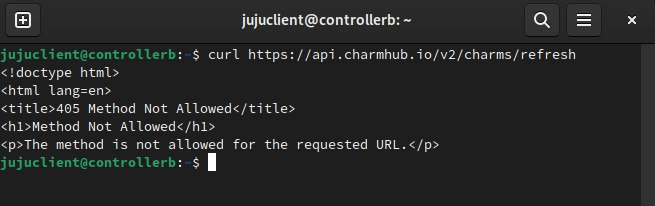

# JUJU IO Timeout ao Dar Deploy de Charm

## Background e contextualização
### MAAS e JUJU
Em nosso cluster, usamos uma implementação usando MAAS e JUJU para dar deploy no OpenStack. O JUJU é usado para lançar as
aplicações dos servições do OpenStack, como o neutron, o nova, etc. \
Para dar deploy nos serviços, o JUJU precisa de uma cloud, ou seja, um substrato a qual ele estará conectado para poder
criar VMs para lançar seus charms.

Além disso, o JUJU precisa dar bootstrap em uma máquina (física ou virtual) para que esteja rodando constantemente e 
possa estar realizando suas ativdades.

Após ter uma infraestrutura de OpenStack ~~quase~~ completamente estável, surgiu a necessidade de implantar o Swift,
para storage, mas ocorreu o problema descrito a seguir.
### Redes
Por fim, é importante ressaltar que temos duas redes em nosso cluster: uma interna de gerenciamento (a 10.84.0.0/16) 
e uma rede externa (a 200.x.x.x). 

A rede interna é usada somente para comunicação entre o controller, os computes e as VMs 
das aplicações do OpenStack dentro do JUJU. Portanto, ela não tem acesso externo

A rede externa é usada para conexão com a internet e também como pool de alocação de IPs públicos para instâncias do OpenStack.
## Descrição do problema e sintomas
Ao tentar dar deploy do charm do juju, tinhamos o seguinte erro:
```sh
# juju deploy swift-storage
ERROR resolving with preferred channel: Post "https://api.charmhub.io/v2/charms/refresh" dial tcp 185.125.188.54:443: i/o timeout
```
Tentando conexão do controller para a internet, vimos que tinhamos conexão. Além disso, conseguiamos fazer requisições na url passada usando _curl_



Investigando mais a fundo, entramos na VM do JUJU para verificar sua conexão. Para isso pegamos seu IP no MAAS


E entramos na máquina
```sh
ssh ubuntu@10.84.0.11
```
De lá, percebemos que a máquina não tinha acesso a internet

TODO: Achar essa imagem

<!--  

Entretanto, investigando as interfaces, percebemos que as comunicações eram feitas corretamente (colocamos isso?)
-->
Para concluir, uma alteração foi feita em nossa rede recentemente, adicionando uma bridge à interface de rede externa.
Desta maneira, o IP e a rota externa do controller passou a ser feita pela nova bridge (br1) em vez de nossa interface (eno2)
Nossa hipótese é que essa mudança fez a VM perder acesso à internet.

## Resolução do problema
Como foi levantado, realmente havia um problema na nova bridge: o controller faz um NAT da rede 10.84.0.0/16 para seu IP real para que 
as máquinas nesta faixa de IP possam ter acesso à internet. Entretanto, após ser feita a mudança na rede as configurações 
dessa nat não foram atualizadas:
```rules
# nat-rules.rules
table ip nat {
    chain postrouting {
        type nat hook postrouting priority srcnat; policy accept;
        ip saddr 10.84.0.0/16 oif "eno2" snat to 200.x.x.x;      <- Continua na "eno2"
    }
}
```
O serviço de NAT usado é o nftables, que usa este arquivo .rules para definir suas configurações, mas depois mantem em essas definições
em seu próprio sistema.

Para resolver este problema, portanto, basta alterar qual interface é usada para este nat
```diff
# nat-rules.rules
table ip nat {
    chain postrouting {
        type nat hook postrouting priority srcnat; policy accept;
-       ip saddr 10.84.0.0/16 oif "eno2" snat to 200.x.x.x;
+       ip saddr 10.84.0.0/16 oifname "br1" snat to 200.x.x.x;
    }
}
```

Após isso, é preciso aplicar as configurações
```sh
sudo nft -f nat-rules.rules
```
Feito isso, as configurações são aplicadas, o NAT reestabelecido e o JUJU voltou a ter acesso ao charmhub para baixar seus charms.

Apesar da facilidade de usar o arquivo .rules, é importante notar que essas configurações são efêmeras, ou seja, ao reiniciar a máquina
as configurações de NAT são perdidas. \
Para manter essas configurações, é preciso adicionar as configurações nos arquivos de inicialização do nftables, que fica em 
`/etc/nftables.conf` \
1. Por questão de organização, criar um novo diretório com as regras de rede
```sh
sudo mkdir /etc/nftables.d
```
2. Criar um novo arquivo com a nossa regra de NAT
```
# /etc/nftables.d/nat_rede_interna.conf
table ip nat {
    chain postrouting {
        type nat hook postrouting priority srcnat; policy accept;
        ip saddr 10.84.0.0/16 oifname "br1" snat to 200.x.x.x;
    }
}
```
3. Fazer referência ao novo arquivo no arquivo original
```diff
#!/usr/sbin/nft -f

flush ruleset

table inet filter {
        chain input {
                type filter hook input priority 0;
        }
        chain forward {
                type filter hook forward priority 0;
        }
        chain output {
                type filter hook output priority 0;
        }
}

+ include "/etc/nftables.d/*.conf"
```

5. Reiniciar o serviço do nftables
```sh
sudo systemctl restart nftables.service
```
6. Verificar se o serviço está rodando
```sh
sudo systemctl status nftables.service
```
E pronto, temos um nat persistente funcionando.
Por fim, é importante reiniciarmos a máquina para ter certeza que essas configurações estarão funcionando
```sh
sudo reboot now
```

## Conclusão e comentários adicionais
Esse foi o último erro desde nossa última alteração de rede (até agora). Portanto, quando alterações forem feitas na interface externa,
também devem alterar nas configurações de NAT de nosso controller.


## Referências e links úteis
[Nova configuração das tabelas de nat do nftables](https://serverfault.com/questions/1059391/nftables-error-interface-does-not-exist-after-reboot)
