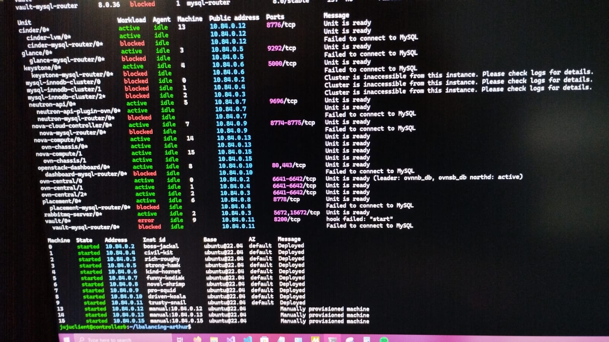
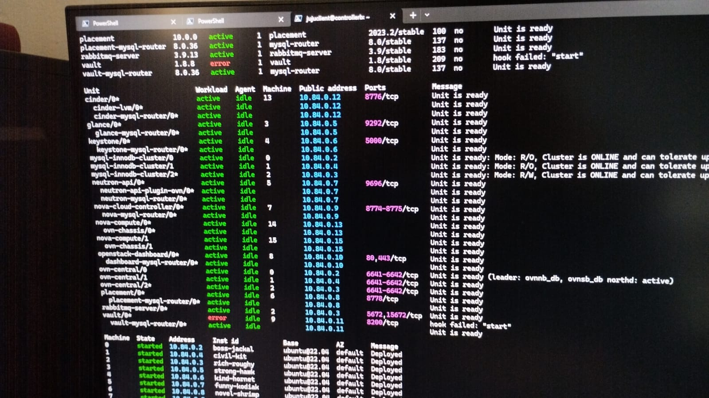
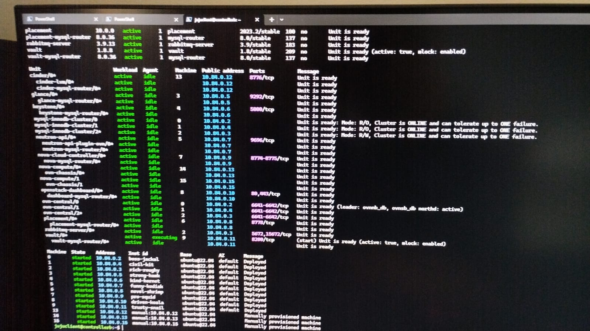

# Start MySQL InnoDB Cluster from a complete outage
Regardless of how MySQL InnoDB Cluster services were shut down (gracefully, hard shutdown, or power outage) a special startup procedure is required in order to put the cloud database back online.

- https://docs.openstack.org/charm-guide/2023.2/admin/ops-start-innodb-from-outage.html

```sh
juju run mysql-innodb-cluster/0 reboot-cluster-from-complete-outage
juju run mysql-innodb-cluster/1 reboot-cluster-from-complete-outage
juju run mysql-innodb-cluster/2 reboot-cluster-from-complete-outage
juju run mysql-innodb-cluster/leader reboot-cluster-from-complete-outage
```


# Unseal Vault
- https://docs.openstack.org/project-deploy-guide/charm-deployment-guide/ussuri/app-vault.html

```sh
juju run vault/0 restart

juju ssh vault/0

cat credentials.txt

export VAULT_ADDR="http://127.0.0.1:8200"

vault operator unseal
```

